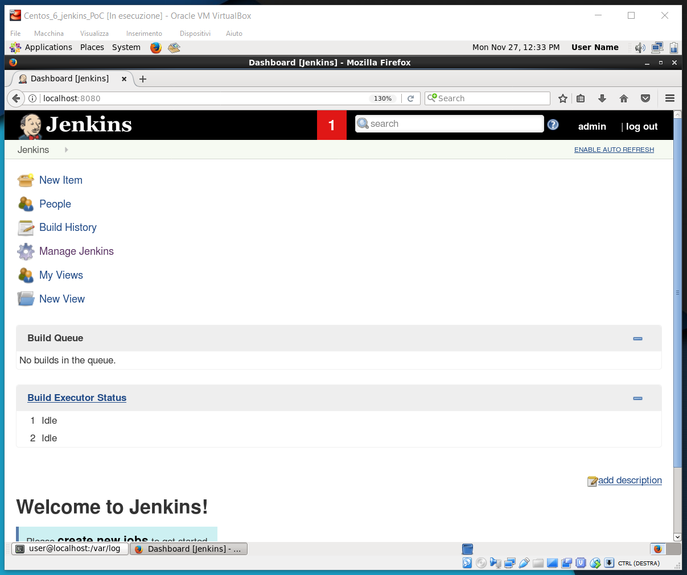
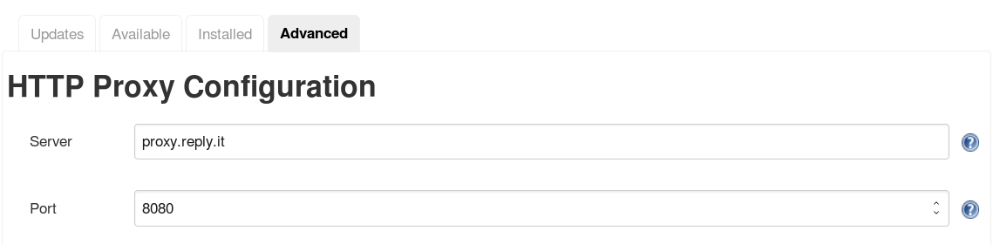
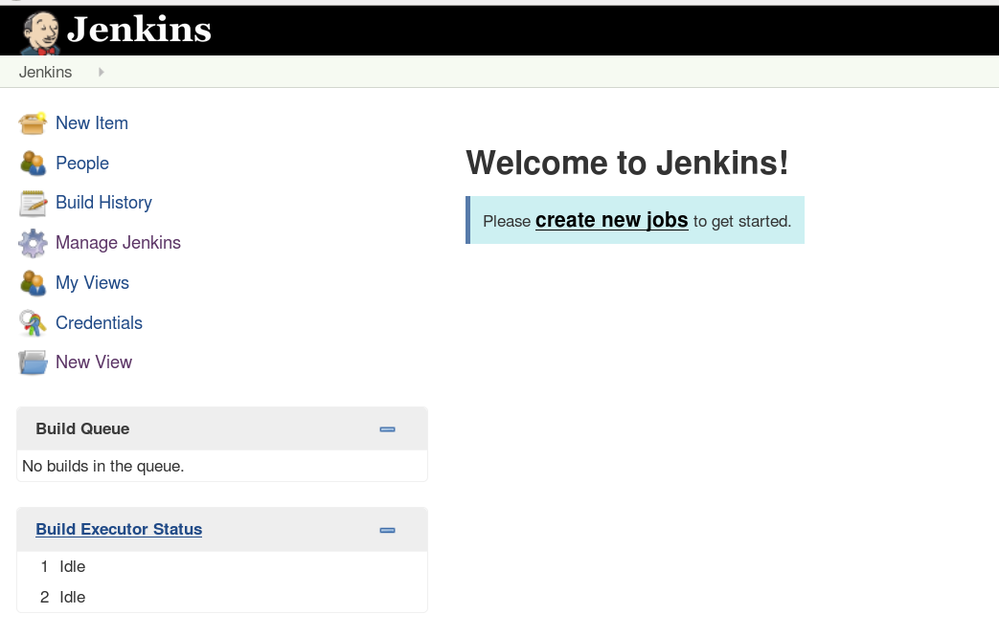
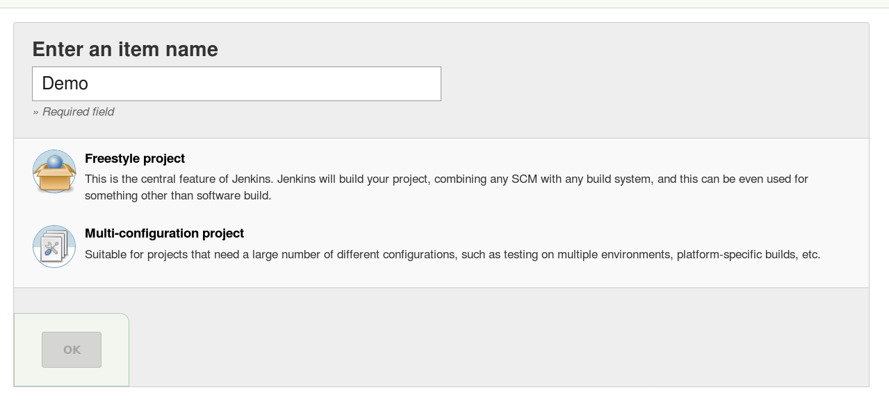
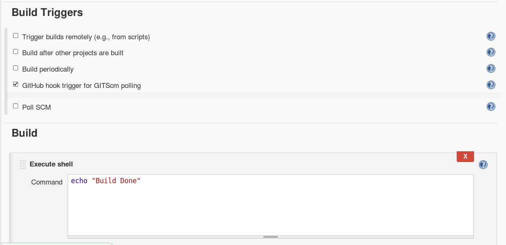
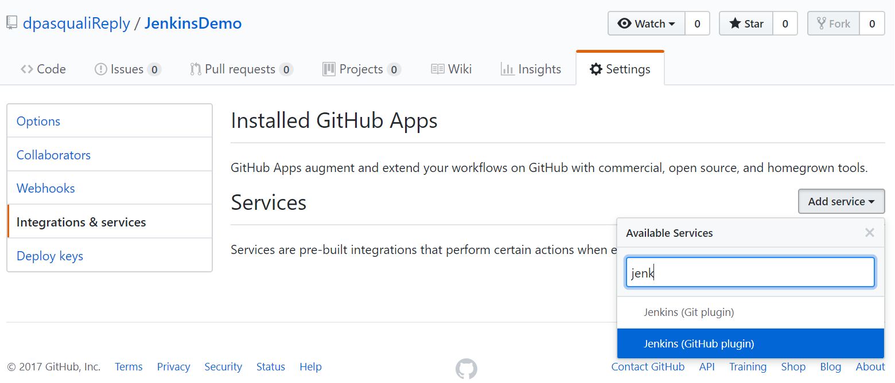
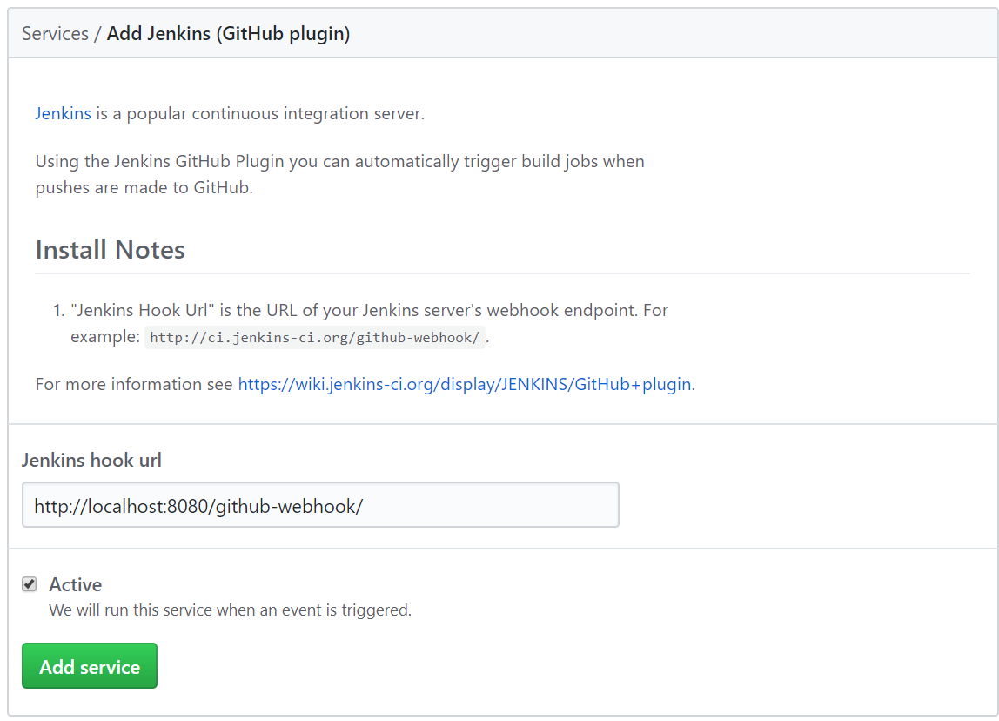

[Install_centos]: InstallazioneCentos6.7.png "Installazione di centos con minimal Destktop GUI"
[create_user]: createUser.png "Creazione utente"
[fire1]: firewall1.jpg "Firewall TUI 1"
[fire2]: firewall2.jpg "Firewall TUI 2"
[fire3]: firewall3.jpg "Firewall TUI 3"
[fire4]: firewall4.jpg "Firewall TUI 4"
[fire5]: firewall5.jpg "Firewall TUI 5"
[unlock_jenkins]: unlock_jenkins.png "ulock"


# Deploy di Jenkins 2.91 per Mondadori

## Installazione VM

* Download di Centos v6.7 da http://archive.kernel.org/centos-vault/6.7/isos/x86_64/

---

## Creazione macchina virtuale si Virtual Box:
* Centos v6.7
* 8 GB RAM
* 20 GB Hdd

---

## Installazione di Centos 6.7
* Selezionare lingua inglese
* Selezionare lingua italiana per la tastiera
* Impostare l'orario su "Europe,Rome"
* Root Password : password

![alt text][Install_centos]

* Create a user : **user** con password : **password**

![alt text][create_user]

* Reboot

* Imposta il proxy (se sei in sede reply)

```bash
su
Password: *******

vi /etc/yum.conf

#aggiungi in fondo
proxy=http://proxy.reply.it:8080

vi /etc/profile

#aggiungi in fondo
export http_proxy=http://proxy.reply.it:8080
export https_proxy=http://proxy.reply.it:8080

source /etc/profile
```

* Imposta la connessione automatica al boot

```bash
vi /etc/sysconfig/network-scritps/ifcfg-eth0

#modifica
ONBOOT=yes
```

* Aggiorna il sistema

```bash
sudo yum update -y
```

* Se vuoi, installa le Virtual Box guest additions (io lo trovo molto comodo, michele le odia)

```bash
sudo yum update
sudo yum install gcc
sudo yum install kernel-headers
sudo yum install kernel-devel
```

---

## Installazione di jenkins

Per l'installazione di jenkins seguirò un misto tra questa [guida per Centos 7](https://www.digitalocean.com/community/tutorials/how-to-set-up-jenkins-for-continuous-development-integration-on-centos-7)
 e questa [guida specifica per Centos 6](https://wiki.jenkins.io/display/JENKINS/Installing+Jenkins+on+Red+Hat+distributions).

### Ottenere un utente NON root con privilegi di root

Il nostro utente *user* va più che bene a questo scopo, per garantigli privilegi di root è necessario editare il file `/etc/sudoers` ma, mi raccomando, **NON FARLO MAI CON VIM**.

Usa invece:
```bash
su
Password: ******

visudo
```
Giusto per capire cosa andremo a fare: `root ALL=(ALL:ALL) ALL`
* *root* indica l'utente
* Il primo *ALL* indica che la regola si applica ad ogni host
* Il secondo *ALL* indica che l'utente root esegue comandi per ogni altro utente (tramite sudo)
* Il terzo *ALL* indica che può eseguire comandi per ogni gruppo
* L'ultimo *ALL* indica che la regola si applica a qualsiasi comando

Decommenta la riga

```bash
%wheel ALL=(ALL) ALL
```

In modo da garantire tutti i diritti agli utenti del gruppo wheel.
Quindi aggiungi *user* al gruppo wheel

```bash
sudo usermod -aG wheel username

reboot #per rendere valida la modifica
```

Puoi trovare maggiori informazioni su come gestire i diritti sudo a [questa pagine](https://www.digitalocean.com/community/tutorials/how-to-edit-the-sudoers-file-on-ubuntu-and-centos).

### Installazione di Jenkins da pacchetto RPM

Tutti i comandi dovranno essere fatti con l'utente **NON ROOT** tramite sudo.

#### Installare java 1.8

Per prima cosa installiamo java, questa versione di jenkins richiede java 1.8

Connettiti alla pagina di [oracle](http://www.oracle.com/technetwork/java/javase/downloads/jdk8-downloads-2133151.html), accetta la licenza e scarica **jdk-8u151-linux-x64.tar.gz**.

``` bash
cd /opt
wget http://download.oracle.com/otn-pub/java/jdk/8u151-b12/e758a0de34e24606bca991d704f6dcbf/jdk-8u151-linux-x64.rpm?AuthParam=1511780178_e971f91c277e5926c5a9b60179d896de

sudo rpm -ivh jdk-8u151-linux-x64.rpm\?AuthParam\=1511780178_e971f91c277e5926c5a9b60179d896de

java -version
java version "1.8.0_151"
Java(TM) SE Runtime Environment (build 1.8.0_151-b12)
Java HotSpot(TM) 64-Bit Server VM (build 25.151-b12, mixed mode)

# per salvare spazio
sudo rm -rf jdk-8u151-linux-x64.rpm\?AuthParam\=1511780178_e971f91c277e5926c5a9b60179d896de
```

#### Download del repo RPM

Scarica il pacchetto RPM di jenkins, puoi spostarti in `/etc/yum.repos.d` oppure eseguire direttamente

```bash
sudo wget -O /etc/yum.repos.d/jenkins.repo http://pkg.jenkins-ci.org/redhat/jenkins.repo
```

Importa il codice di verifica di validità del pacchetto

```bash
sudo rpm --import https://jenkins-ci.org/redhat/jenkins-ci.org.key
```

Se, per una qualche ragione, rpm non riesce a scaricare la chiave restituendo un errore 404 (come è successo a me):

```bash
sudo wget https://jenkins-ci.org/redhat/jenkins-ci.org.key
sudo rpm --import jenkins-ci.org.key
```

#### Installazione con yum

Una volta fatto possiamo installare jenkins con yum.

```bash
sudo yum install jenkins
```

Terminata l'installazione, avviamo il servizio di jenkins e impostiamo l'avvio automatico

```bash
sudo service jenkins start
sudo chkconfig jenkins on
```

#### File utili

E' stato creato un utente *jenkins* pensato per eseguire tutto quello che è legato al servizio, puoi modificare questo utente nel file di config , ma ricorda di cambiare i privilegi a `/var/log/jenkins, /var/lib/jenkins e /var/cache/jenkins.

Troverai i file di log in 

Cosa    | File
------- | -------
Config  | `/etc/sysconfig/jenkins`
Log     | `/var/log/jenkins/jenkins.log`

#### Connessione al servizio e firewall

Usa `service jenkins start/stop/status` per gestire il servizio.

All'avvio del servizio, potrai interagire con jenkins tramite il tuo browser alla porta **8080**, il firewall potrebbe darti dei disagi, per disabilitarlo, in Centos 6.7 non possiamo usare `firewalld`, utilizzeremo la TUI di `system-config-firewall`

```bash
sudo iptables -L #per vedere le attuali regole
```

Per modificare permanentemente il firewall, in modo da aprire la porta **tcp:8080**

```bash
sudo system-config-firewall-tui
```

![alt text][fire1]
![alt text][fire2]
![alt text][fire3]
Ovviamente inserisci la porta 8080
![alt text][fire4]

OK -> Back -> Close -> Ok

![alt text][fire5]

---

## Avvio e utilizzo di jenkins

```bash
sudo service jenkins start
Starting Jenkins                                           [  OK  ]

```
E collegati alla pagina `http://localhost:8080`, dovrebbe aprirsi una pagina del genere.

![alt text][unlock_jenkins]

Scopriamo la password autogenerata

```bash
sudo cat /var/lib/jenkins/secrets/initialAdminPassword
ab21de47d4cf4d70856f57d953fb84bf
```

### Installazione plugin

Quindi installiamo i plugin che ci servono (io devo fare una prova, ho installato quelli di default).


**Attenzione** se sei dietro a un proxy questa procedura fallirà malamente, questo perchè jenkins ha bisogno di una configurazione proxy ma nessuno ci ha dato la possibilità di configurarlo.

Non preoccuparti per ora, fai continua e ci pensiamo dopo.

### Creazione utente admin

Per comodità ho creato un utente admin default:
* Username = admin
* Password = admin

Se tutto va bene dovrebbe aprirsi l'homepage di jenkins.



---

## Configurare Jenkins

### Proxy

Manage Jenkins -> Manage Plugins -> "Advanced" tab.
Qui puoi impostare il proxy reply.




### Enable Global Security

Manage Jenkins -> Configure Global Security

Se la spunta non è presente, spuntare *Enable Security*

//TODO Spuntare Matrix-based security e configura un utente admin (non c'è il checkbox) (https://wiki.jenkins.io/display/JENKINS/Matrix-based+security)

### Installare Plugin

Manage Jenkins -> Manage Plugins -> "Available" tab

Seleziona i plugin che desideri, per la mia Demo ho selezionato solo **GIT plugin** e **GitHub Plugin** dal momento che il progetto da gestire si trova su github.
In ogni caso jenkins ha installato anche tutti i plugin che erano falliti nell'installazione iniziale.

Esegui l'installazione con restart e, al termine, torna alla Top Page.

### Configurare GIT

Se Git non è installato nell'host questo non funzionerà nemmeno su jenkins (grazie al cazzo).

```bash
sudo yum install git -y

# Per sapere dove è stato installato
sudo which git
/usr/bin/git
```
Inoltre dovremo configuralo in Jenkins, andiamo quindi in Manage Jenkins -> Configure System -> sezione Git Plugin
e inseriamo nome utente e email dell'account usato nel repository.


Non possiamo però ancora accedere al repository, la configurazione sarà completata all'inserimento del link (prossia sezione).

## Demo

Nella homepage creiamo un *New Job* dal pulsante centrale se non ne abbiamo o da *New Item* a sinistra.



Metti il nome che preferisci e seleziona *Freestyle Project*



Imposta la descrizione, spunta *GitHub project* e inserisci il link del repository (intendo l'**URL nella barra di navigazione**)


Qui invece imposta il **link per clonare il repository** e le credenziali dell'account GitHub


Imposta poi il build del job Jenkins in modo che venga eseguito ogni volta che viene fatto un commit git.

Inoltre puoi impostare una serie di comandi che vengono fatti durante la build, strumento potentissimo, **da imparare ad usare**.



### Configurazione Webhook GitHub

Un webhook è un collegamento che permette di scatenare un determinato evento tra due differenti servizi web. In questo caso, vogliamo fare in modo che, nel momento in cui viene fatto il commit di su GitHub, venga fatta una POST `http://localhost:8080/hithub-webhook`. Questa chiamata scatenerà build, test, deploy e compagnia bella.

La configurazioni deve essere fatta lato GitHub, al momento è implementata come un servizio, non come un webhook, andiamo quindi nella pagina **Integration & Services**



Imposta il link del server su cui è presente jenkins.




